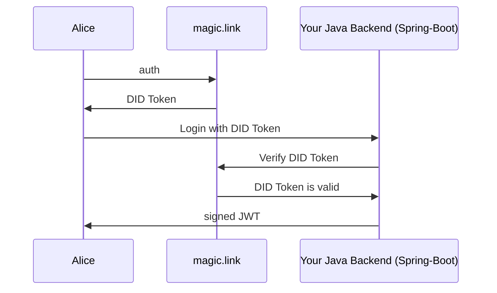

### 
munich developer proudly presents

# 
user-service with magic.link login

# What is it?

This user-service provides a library for Spring-Boot 3 that can be used to integrate with the authentication service from https://magic.link.
You can add your own Java Backend that uses his own JWT authentication and combine it.
When implemented, the workflow looks as follows:

1. Your User of your app wants to login to your application and enters his email adress into the login mask of your frontend.
2. An One-Time-Password OTP is being created and shown to the user. At the same time, he gets an email with a login link.
3. He clicks the link and gets a prompt to enter the previously shown OTP.
4. If the OTP is being provided correctly, the window can be closed. The browser window, that initiated the login will later get logged in.
5. The magic.link service returns a [decentralized ID Token (DIDT)](https://magic.link/docs/dedicated/introduction/decentralized-id)
6. This DIDT then should be propagated to your backend. Your backend should verify the DID Token is valid (through calling the magic.link API) and the issuer is the expected email adress.
7. When validated, your backend can issue a JWT and handle it in the response header to your frontend. The user is now authenticated with his email.

# What do you need?

- You will need a [magic.link](https://magic.link) account that can be obtained for free.
- You need to implement your own frontend and backend logic (and integrate this library here into your backend). Also checkout the reference implementations (see links down below).
- Optional: If you would like to add users to e.g. mailerLite: a mailerLite account (see description down below).

# Reference implementations

You can checkout the boilerplate / reference projects that demonstrate the whole workflow. The projects are realized with Spring Boot 3 and React 18.
 Checkout the Spring Boot project [here](https://github.com/munichdeveloper/spring-boot-magic-link) and the React project [here](https://github.com/munichdeveloper/documan-journal-react-fe/).
 Also you can see the auth live in action in a demo app [here](https://documan.onrender.com).

# Benefits of a magic.link auth

The described workflow has a lot of advantages and offers a great user experience:

1. Your users don't have to deal with finding and reconing complex passwords, which often times only results in people just writing their passwords to unsecure places.
2. You don't have to deal with fake registrations or verifying if the email adress provided is valid.
3. You get a TFA out of the box, which adds additional layer of security.
4. You don't need users to register explicitly. In the example implementation, a new user is registered automatically, if it doesn't exist yet. However, this is of course dependant on your projects requirements.
5. You don't need to deal with 'forgot password' functionality and your users don't have to deal with that also. They can always login, as long as they have access to their email (they always do).
6. You don't need to setup infrastructure for sending emails.

# Is this really secure? What if the email account of my user is being hacked?

Yes, this is very secure. However, there is nothing that cannot be hacked / compromised. 
Also please consider, if your users email account gets hacked, a new password can easily be obtained at the most applications / websites through the 'forgot password' functionality.

# Features

There are two kafka topics that are sending a message when a user signs in with his email adress:
- When a user gets registered: "user-created" 
- When a user logs in: "user-signin-magic-link"

  Also checkout the reference implementation, that will add users to a mailerlite group that you have configured (You will need a [mailerLite](https://mailerlite.com) account)
